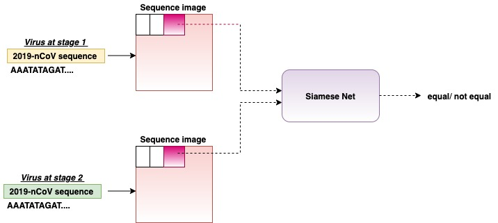

#AI against COVID-2019


## Purpose 

Deep learning application to track virus evolution by analyzing the online sequence between two COVID-2019 samples at different time points.
The network is based on a Siamese neural network that takes features of COVID-2019 sequences as input. More specifically, each sequence of n nucleotide bases is converted into an image and passed through a convolutional network. The aim is to find nucleotide sequences that vary from virus and understand COVID-2019 evolution over time and describe the latent space through a generative network. 
The code is released for research purposes only.




## TODO
  * cluster testing with pairwise 
  * Convert into nucleotide bases in an image to pass it towards a convolutional network.


### Prerequisites

Before getting started, it's important to have a working environment with all dependencies satisfied. For this, we recommend using the Anaconda distribution of Python 3.5.

```
cd /tmp
curl -O https://repo.anaconda.com/archive/Anaconda3-2019.03-Linux-x86_64.sh
bash Anaconda3-2019.03-Linux-x86_64.sh
```

So pytorch must be installed, please make sure that cuDNN is installed correctly (https://developer.nvidia.com/cudnn).

```
conda install pytorch torchvision cudatoolkit=9.2 -c pytorch
```

Then install the following libraries:

```
pip install torchvision
pip install opencv-python
pip install matplotlib
pip install tqdm
```


### Installing

To start the code: 

```
python main.py
```

## Authors

* ** Nicolò Savioli, PhD ** - *Initial work* 

## License

This project is licensed under the MIT License - see the [LICENSE.md](LICENSE.md) file for details

## Acknowledgments

* Hat tip to anyone whose code was used
* Inspiration
* etc