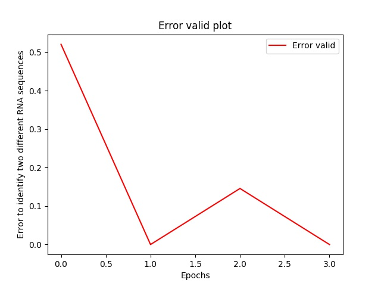

# Artificial Intelligence model for the analysis of COVID-2019 

## Purpose 

Deep learning application idea to track COVID-2019 virus evolution by analyzing the RNA sequence between two COVID-2019 samples at different time points (i.e for example December COVID-2019  and the current one). 

The system is still under development and does not currently guarantee any immediate application. 

This was done as the purpose of creating an interface between the COVID-2019 sequences currently available and deep learning to guarantee future applications in this direction and speed up the creation of a vaccine.


The network is based on a deep Siamese Neural Network (https://en.wikipedia.org/wiki/Siamese_neural_network) that takes a strand of RAN COVID-2019 sequences as input - taken at different time points instants.

More specifically, each strand is converted into a grayscale image of 256x256 pixels size and passed through two   AlexNet (https://papers.nips.cc/paper/4824-imagenet-classification-with-deep-convolutional-neural-networks.pdf) Convolutional Networks (CNN). However, both CNN are trained towards negative examples with Human Immunodeficiency Viruses (HIV) strand examples (i.e how it is a biologically different virus).

The aim is to find nucleotide sequences that stably characterizes COVID-2019 for finding a specific RNA biomarker strand.
In particular, it might be useful to compare the variation over time of the densely glycosylated spike (S) protein sequences which coronavirus uses to enter in the host cell (https://science.sciencemag.org/content/early/2020/02/19/science.abb2507/tab-pdf).

This work is in progress and since I do it in my spare time.

However, understanding the urgency of the phenomenon, I decided to make the code available to give new analysis tools to the international scientific community. 


### Wuhan-Hu-1 isolated coronavirus 2 complete genome sequences have been downloaded from link below and saved in the project folder ./virus_genome

https://www.ncbi.nlm.nih.gov/nuccore/MN908947.3?report=fasta

### The Human Immunodeficiency Viruses (HIV) complete genome sequence has been downloaded from link below and saved in the project folder ./virus_genome

https://www.ncbi.nlm.nih.gov/nuccore/NC_001722.1?report=fasta


The code is released for research purposes only and not for commercial purposes.


## USE

* Generation of the dataset (COVID-2019 vs HIV) - go to ./get_dataset folder then open main file change the paths of the HIV and COVID-2019 sequences and the folder where to save the dataset.

* I used two AlexNet networks pretrained on imagenet (http://www.image-net.org/). The network converges quickly and then overfits for greater epochs (i.e. probably due to the limited number of data used) - for training just python train.py - you don't need a GPU as I chose a very shallow network that can allow you to train the model quickly. Here a first validation chart on 400 total interactions.




## TODO

* Test with different length of RNA sequences
* Build an inference system to analyze strands RNA length between two different coranaviruses sequence.


### Prerequisites

Before getting started, it's important to have a working environment with all dependencies satisfied. For this, we recommend using the Anaconda distribution of Python 3.5.

```
cd /tmp
curl -O https://repo.anaconda.com/archive/Anaconda3-2019.03-Linux-x86_64.sh
bash Anaconda3-2019.03-Linux-x86_64.sh
```

So pytorch must be installed, please make sure that cuDNN is installed correctly (https://developer.nvidia.com/cudnn).

```
conda install pytorch torchvision cudatoolkit=9.2 -c pytorch
```

Then install the following libraries:

```
pip install torchvision
pip install opencv-python
pip install matplotlib
pip install tqdm
```


### Installing

To start the code: 

```
python main.py
```

## Authors

* ** Nicolò Savioli, PhD ** - *Initial work* 

## License

This work is licensed under a Creative Commons Attribution-NonCommercial-ShareAlike 4.0 International License.

This [license](./LICENSE.md) applies to all published OONI data.
